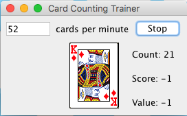

# card-counting-trainer
_A trainer to improve your card counting_



## Introduction
Card Counting is particularly useful in Blackjack when trying to decide whether to Hit or Stand. As the cards flash 
by, you maintain a running count that tells you whether the deck is loaded with low or high cards at any given point 
in time. In the High-Low method of card counting, each card is given a value:

- Cards from 2 - 6 have a value of +1
- Cards 7 - 9 have a value of 0
- Cards 10 - A have a value of -1

## Method
The trainer walks you through a single deck at the desired cards per minute speed and you have to keep track of the 
current score. As you get better, increase the speed to challenge yourself or add music and other distractions when
to make it harder. The goal is to make card counting so effortless that it becomes second nature to you on the casino
floor.  
 
The on-screen guide lets you know how well you're doing:

- Count: The number of cards counted
- Score: The current score
- Value: The value of each card

## How To Run
1. ```mvn clean package```
2. ```java -jar target/card-counting-trainer-1.0.0.jar```

###### Happy Training!
